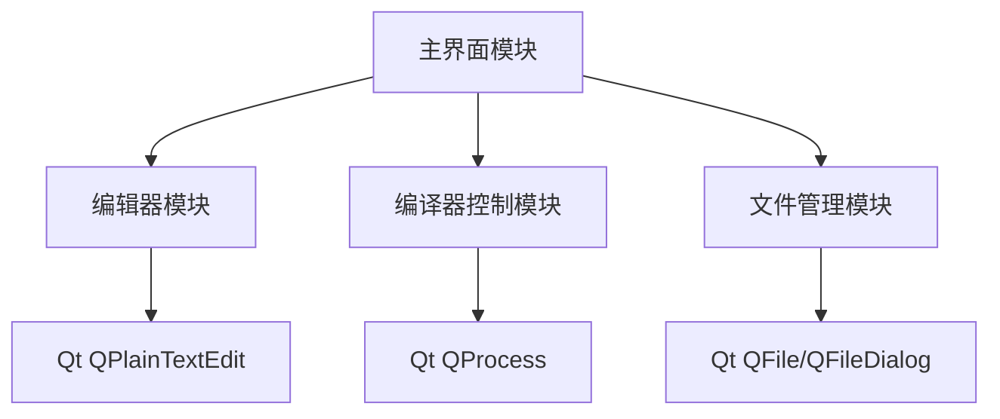
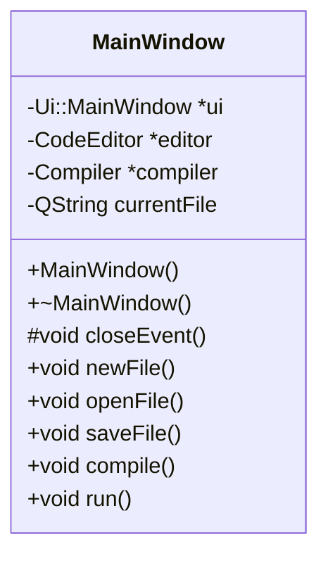
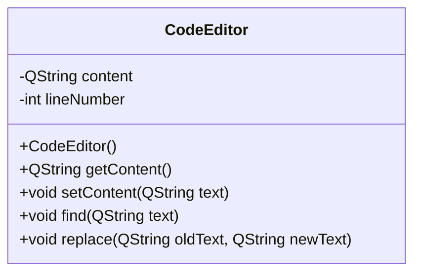
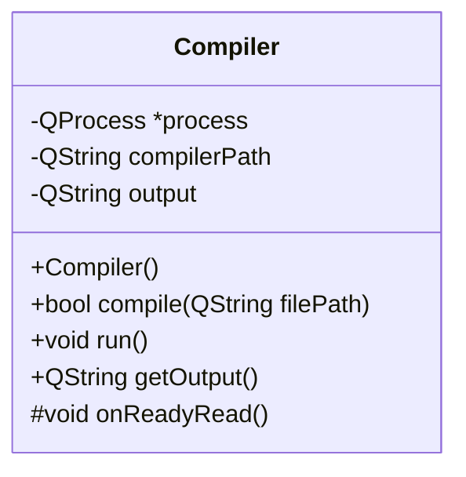
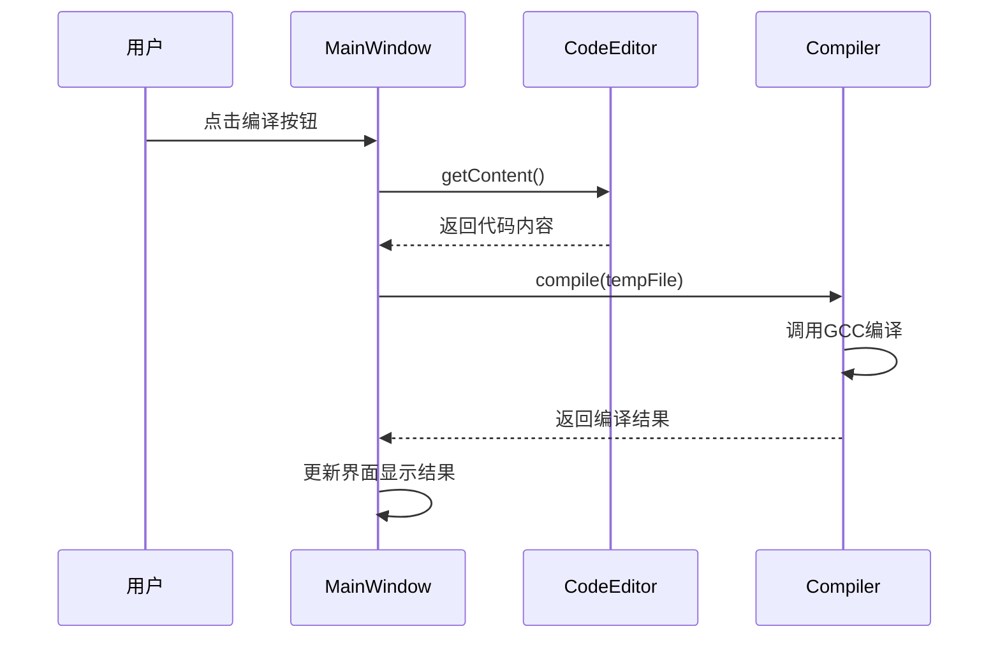

# [你的 IDE 名称] 软件设计文档

## 1. 总体设计

### 1.1 系统架构图

[此处绘制系统架构图，如以下 mermaid 代码生成]



1.2 技术选型与理由

· 开发框架: Qt 6.x
· 理由：跨平台特性、丰富的 UI 组件、信号槽机制适合桌面应用开发
· 编译器: MinGW-w64 GCC
· 理由：Windows 平台标准 C 编译器，与 Qt 兼容性好
· 开发语言: C++
· 理由：项目要求，Qt 原生支持

2. 模块设计

2.1 主界面模块(MainWindow)

2.1.1 类图



2.1.2 类职责说明

· MainWindow: 主窗口类，负责界面布局、菜单工具栏创建、模块协调

2.2 编辑器模块(CodeEditor)

2.2.1 类图



2.2.2 类职责说明

· CodeEditor: 负责代码编辑相关功能，基于 QPlainTextEdit 扩展

2.3 编译器控制模块(Compiler)

2.3.1 类图



2.3.2 类职责说明

· Compiler: 封装编译过程，负责调用 GCC 编译器并捕获输出

3. 界面设计

3.1 界面布局

[此处描述或图示界面布局]

· 顶部：菜单栏、工具栏
· 中部：代码编辑区(主要区域)
· 底部：状态栏(显示行号、编译状态等信息)
· 下部：输出面板(显示编译结果)

3.2 界面交互流程

3.2.1 编译流程



4. 数据结构设计

4.1 核心数据结构

本项目主要使用 Qt 内置数据结构：

· QString: 存储文本内容
· QStringList: 存储代码行（如需要）
· QTextCursor: 处理文本编辑位置

5. 关键算法设计

5.1 编译流程算法

```
算法：compileCode
输入：sourceCode（源代码字符串）
输出：编译成功与否及编译输出

1. 将sourceCode写入临时文件
2. 构造GCC编译命令：gcc -o output.exe tempfile.c
3. 使用QProcess执行编译命令
4. 捕获标准输出和标准错误
5. 如果返回值为0，返回成功；否则返回失败和错误信息
```

6. 测试策略

6.1 单元测试

· 编辑器模块：测试文本操作功能
· 编译器模块：测试编译流程

6.2 集成测试

· 完整流程测试：编辑->编译->运行

7. 附录

7.1 参考资料

· Qt 官方文档：https://doc.qt.io/
· GCC 手册：https://gcc.gnu.org/onlinedocs/

7.2 修订历史

版本 日期 作者 说明
v1.0 2025-09-XX [组长名] 初稿创建

```

---
```
